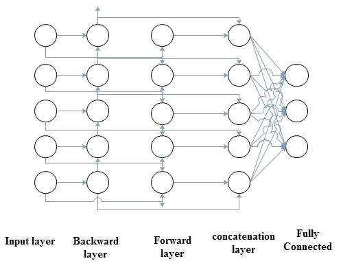
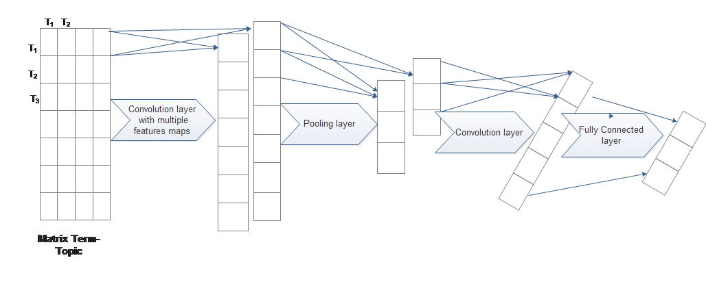
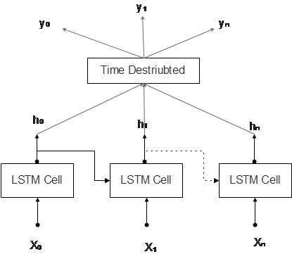
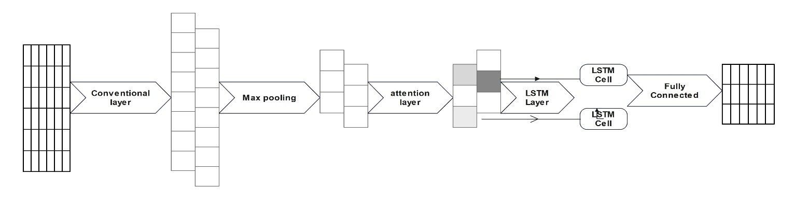

<h1 align="center">News Personalized Content-Based Recommender Systems </h1>
<h3 align="center">by Using NLP, Deep Learning RNN and CNN Approaches</h3>

# Introduction
 . Autonomous recommender systems are the systems that help users find and select interest items. One of the main strategies to make identification of user interests in a news portal is the read news content.  This project offers a personalized news recommender system in which user interests can be predicted based on the contents of news read by their users, extracting keywords, and finding semantic relations between them. One of the topic modeling algorithms is Latent Dirichlet Allocation (LDA), which scores terms based on repetition of terms. Deep neural networks have a great success in many NLP tasks, which are based on RNN, CNN, LSTM, and recently attention mechanisms inspired by neuroscience. The experimental work is done in Python language and finally compares six kinds of DNN in the prediction of interest news which proposed a structure that involves CNN to extract local information, an attention layer to extract semantic information from critical words, and LSTM to extract dependencies between words. This proposed DNN possesses a higher F1 measure in comparison with others. The input of DNN is a term-topic matrix and the output is user-topic for each document.

# Proposed Model

- [Introduction](#introduction)
- [Proposed Model](#proposed-model)
- [Data Description](#data-description)
- [Data Preprocessing](#data-preprocessing)
- [Analysis](#analysis)
- [Experimental Results](#experimental-results)
  - [Training Section](#training-section)
  - [Testing Section](#testing-section)
- [Evaluation](#evaluation)

# Data Description

The data has been collected from three Irish online news sources (RTE, Irish Times and Irish Independent
| Data Collections | Number | |--------------------------------|--------------------| | User | 31 | | News | 3857 | | Time Collected Data | 2009/7/8 – 2009/7/31 |
Table 1. Data Statistics

Table 2. Example of Transaction in Dataset
| User_id | article_id | |--------------------|------------| | 31 | 6 | | 3857 | 7 | | 2009/7/8 – 2009/7/31 | 13 |

Table 3. Example Article of Term Index and Frequency Pairs
| term_indexN:freqN | ... | term_index2:freq2 | term_index1:freq1 | article data | article_id |
|-------------------|-----|-------------------|-------------------|---------------|-------------|
| 01:270            | ... | 06:01             | 04:147            | 08/07/2009    | 2           |
| 01:353            | ... | 01:752            | 01:351            | 21/07/2009    | 2237        |
| 01:459            | ... | 03:01             | 01:460            | 31/07/2009    | 3686        |

Table 4. List of some Unique Terms

| Term_id | Term     |
|---------|----------|
| 20      | Swedish  |
| 753     | told     |

# Data Preprocessing
To preprocess textual data, Word2vec Tools unsupervised learning of word-level conversion of text to numeric vector is employed. The more complicated steps were implemented for data preparation for the data mining process. The preprocessing of the content consists of the following five steps:
	Normalization and Tokenize
	Tagging and removing some roles of terms, e.g. adverbs, prepositions, and others.
	Removing stop terms
	Stemming
	Creation of the document-term matrix: scoring term is based upon Term Frequency (TF)
# Analysis
Research often ignores context or incorporates them as ordinary features in using a deep-neural network; since deep-neural networks have a large capacity to learn a complex decision function. In the proposed system, the use of learner resources is dramatically increasing and, with its application, it can offer new items in according to user interests.
Deep learning has revolutionized NLP tasks with two kinds of popular neural networks, RNN with sequence architecture and CNN with hierarchical architecture (Nakatsuji et al., 2016).  
BRNN is good modeling for a sequence of data and can learn the relationship between past and future information . The structure of BRNN is the split of the state neurons into two layers the forward layer is responsible for the positive direction (forward state) and the backward layer is responsible for the negative direction (backward state). Outputs from the forward state are not connected to the backward state and vice versa. In the third layer, the forward and backward layers must be concatenated and finally, for approaching to output size, the fully connected layer is implemented. Figure 2 shows the structure of a Bidirectional Recurrent Neural Network (BRNN) and its different layers.
 

Fig 2. Structure of BRNN
Because of local correlation and positive invariance, CNN can extract local information, and ignore contextual semantic information in NLP tasks (YAN CHENG 1, 2020). Also, it extracts the most informative n-gram. CNN allows users to discover a new learning resource that matches their interests and can be used for predicting latent factors from text information. The paper (Ali et al., 2016) shows significant improvements over CNN on public datasets, better performance than the other neural networks, like, MLP, and confronting a cold start problem. Subsequently, it is a bridge between text information and a matrix with high scarcity and user interests in latent factors. Additionally, the usefulness of CNN in comparison with LSTM is reducing the dimensions of input features, particularly, To remove all irrelevant and useless features, and extract only effective 

This structure of CNN is formed in four layers [6] depicted which added convolution layer to create new feature vector. CNN is complete in the fully connected layer.
 

Fig 4. Structure of CNN with 4 layers

A long Short-Term Memory (LSTM) network is a kind of RNN based on historical patterns that learn short-term and long-term by using independent memories and has a good performance in sequential data (Choi & Suh, 2013). But, this networks suffer from the lack of ability to extract local features.(Beakcheol JangORCID, 2020)
LSTM unit keeps an existing memory at time t. the input at time t is Xt , ht-1 , Ct-1, and the output is ht , Ct:
i_t=σ(w_i  [h_(t-1),x_t ]+ b_i)
(3)
f_t=σ(w_f  [h_(t-1),x_t ]+ b_f)
(4)
O_t=σ(w_o  [h_(t-1),x_t ]+ b_o)
(5)
g_t=tanh(w_c  [h_(t-1),x_t ]+ b_c)
(6)
C_t= f_t×C_(t-1)+ i_t  × g_t	(7)
h_t= O_t× 〖tanh(C〗_t)	(8)
LSTM has cell blocks, that its structure is presented in figure 5, which consists of an input gate (1) which is a layer of sigmoid function, forget layer (2) which helps the network train which state must be remembered, output gate (3) which determines output values.
The output of the input gate is calculated according to (6), the output of forget gate is Ct (7), and the output of the output gate is ht (8).
If suppose the input is [x0, x1,…, xn] and the output is [y0, y1, ..., yn].

 

Fig 5. LSTM Structure

In the paper [31], one proposed neural network composes of multiple inputs and two LSTM units, capturing previous connections, and time series corrections returned by the former LSTM. In that these multiple inputs include historical records and external factors such as weather or calendrical planning.  
To access past and future information for learning and predicting, BLSTM is implemented. The structure of BLSTM is similar to BRNN, which has a forward layer and backward layer, but neurons substitute with cell LSTM to maintain the memory for both the past and future (Fouss et al., 2007).
CNN extracts the hidden features from item descriptions, and LSTM is a recurrent neural network, which has good performance in modeling sequence data and historical data and can learn long and short term. The combination of CNN and LSTM has good performance in capturing contextual information and possible to increase the performance of CNN by incorporating facts of a brain, which is implemented according to historical records in memories.
This structure figure 6 has four layers. Input layer is the first layer in the model, which represents the matrix term-topic. The second layer is the CNN, which is used to fix the size of filters and detects multiple features in order to represent them in feature maps. Pooling layer as third layer selects features with max operation in order to capture the most important features. LSTM layer has an ability to capturing the sequential data based on historical records for learning. The final layer is connected, which converts the output of LSTM to size of matrix user-document using the sigmoid function.
 
		Fig 6. Combination of CNN and LSTM

Recently, in 2015, different attention mechanisms were introduced to make grades of words according to their importance (Hu, 2019) This mechanism generally is composed of two modules, an encoder for converting input data into semantic vectors, and a decoder for generating output vector after transformation. In some research, this mechanism is embedded with other networks to promote their efficiency. For example, in (Mohd Usama a, 2020), the proposed models of neural networks (Figure 7)include attention mechanism, CNN, and RNN for sentiment analysis. In the proposed model, the CNN layer extracts local information, Max pooling to obtain local features, the attention layer to make word grades according to their importance, and the LSTM layer captures long-term dependencies. 

  
		Fig 7. Combination of CNN and LSTM

In the proposed system, the learning resource is dramatically increasing and by employing them, the accuracy to recommend new items, which will be suitable to the user interests is increasing. For recommendation, six types of DNN focused more on CNN, RNN, and LSTM, are considered. It is notable that by employing an attention mechanism in the combination of CNN to learn local and position invariant features and LSTM to long-term and short-term based on history, the performance of recommendations significantly has been improved.
# Experimental Results
The proposed recommender systems in training are considered in 4 steps:
	After preprocessing of text Create a Matrix of document-terms and user-document.
	Create Matrix topic-document and topic-terms by LDA employed with 42 topics and 200 passes. The number of topics is dependent on the data. In the implemented data the number of topics is tested until 100 but improvement in accuracy and recall is not acquired.
	Employing the mentioned DNN with defined structures in which input is term-topic and output is user-topic 
In testing the recommender system, all steps mentioned in training are included plus multiply user-topic and topic-document to extract user-document. If the value of user-document is more than the threshold, which is supposed 0 in this article, this document is recommended to the user. 
## Training Section
In this section, there is a training set for the news. According to Table 5, some news does not have any transactions from users, who are employed to train the LDA.
Table 5. Training Dataset
| Feature                                     | Value                                   |
|---------------------------------------------|-----------------------------------------|
| Number of News                              | 3131                                    |
| Period Time                                 | 2009/7/8 - 2009/7/27                   |
| Number of Users                             | 31                                      |
| Number of News Transactions Read by Users   | 306                                     |
| Maximum Number of Terms in the News        | 336                                     |

## Testing Section
When testing the system, the main task is to predict fresh news, which should be recommended to users. In the testing news, the news database is in the interval (three days) after the system's training stage, depicted in Table 6.
Table 6. Testing dataset
| Feature                                         | Value                           |
|-------------------------------------------------|---------------------------------|
| The number of news                              | 726                             |
| Period Time                                    | 2009/7/27 - 2009/7/31          |
| The number of users                             | 31                              |
| The number of news transactions read by users   | 48                              |
| The Maximum number of terms in the news        | 336                             |

In multiplying two matrices, the threshold value must be identified. If the calculated value of the result is bigger than the threshold value, the document is recommended to the user. This value is very important because balances whether the news is recommended to the user or not.
threshold=Mean ±Std	(9)
The value of threshold is calculated based on (9).
{█(if R_(user-doc)>threshold ⟹recommend@else ⟹not_recommend) ┤	(10)

Table 7. The summery of Proposed DNN
| Layer (type)                   | Output Shape         | Param # | Connected to                                   |
|--------------------------------|----------------------|---------|------------------------------------------------|
| input_1 (InputLayer)          | (None, 336, 42)      | 0       | []                                             |
| conv1d (Conv1D)               | (None, 336, 62)      | 7502    | ['input_1[0][0]']                            |
| max_pooling1d (MaxPooling1D)  | (None, 42, 62)       | 0       | ['conv1d[0][0]']                             |
| attention (Attention)          | (None, 42, 62)       | 0       | ['max_pooling1d[0][0]', 'max_pooling1d[0][0]'] |
| bidirectional (Bidirectional)  | (None, 42, 32)       | 10112   | ['attention[0][0]']                          |
| dense (Dense)                  | (None, 42, 31)       | 1023    | ['bidirectional[0][0]']                      |
	
# Evaluation
The proposed model evaluates by three measurements, recall, accuracy, and F-measure.
accuracy= □(TP/|recommended| )	(11)
recall= □(TP/|related| )	(12)
F-measure= □((2×(accuracy × recall))/(accuracy+recall))	(13)
TP is the number of news that are recommended to related users, |recommended| is the number of recommended news, and |related| is the number of news related to users. F_1 measure is the harmonic mean of accuracy and recall, and the proposed model is evaluated with this value, F_1 measure.
Table 8. Comparison of DNN
| Model             | Accuracy (avg) | Recall (avg) | F1    | Epoch | Batch Size | Activation Function | Recurrent Activation |
|-------------------|----------------|---------------|-------|-------|------------|---------------------|----------------------|
| CNN (3 layers)    | 0.387          | 0.211         | 0.273 | 5     | 2          | Relu                | ---                  |
| BRNN              | 0.526          | 0.590         | 0.556 | 5     | 2          | tanh                | hard_sigmoid         |
| BLSTM             | 0.772          | 0.933         | 0.844 | 5     | 2          | tanh                | hard_sigmoid         |
| CNN (4 layers)    | 0.810          | 0.832         | 0.820 | 5     | 2          | Relu                | ---                  |
| CNN+LSTM          | 0.840          | 0.886         | 0.862 | 5     | 2          | Relu                | hard_sigmoid         |
|                   |                |               |       |       |            |                     | tanh                 |
| Proposed Model     | 0.898          | 0.955         | 0.925 | 5     | 2          | Relu                | hard_sigmoid         |
|                   |                |               |       |       |            |                     | tanh                 |

Nowadays, deep neural networks have a good performance when long data sets from a wide range of applicants are accessed. Deep learning techniques provide pure content-based recommender systems which CNN and LSTM are two kinds of them employed in text mining.
In this study, six deep neural networks are compared in the field of personalized content-based recommender systems with different structures. In conclusion, the table shows that LSTM can improve recall while CNN can promote accuracy. However, the proposed model includes CNN, max pooling, attention, and LSTM layer possess a great performance in comparison to other proposed models. The high value of recall means that almost all of the news recommended is related to the interests of the user.

